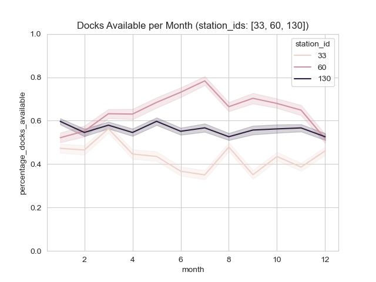
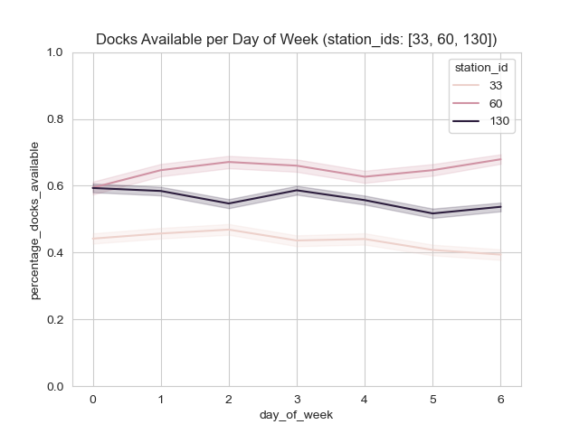
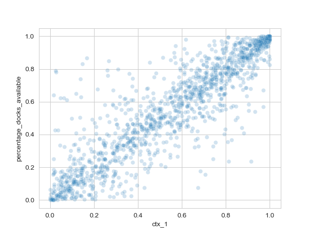
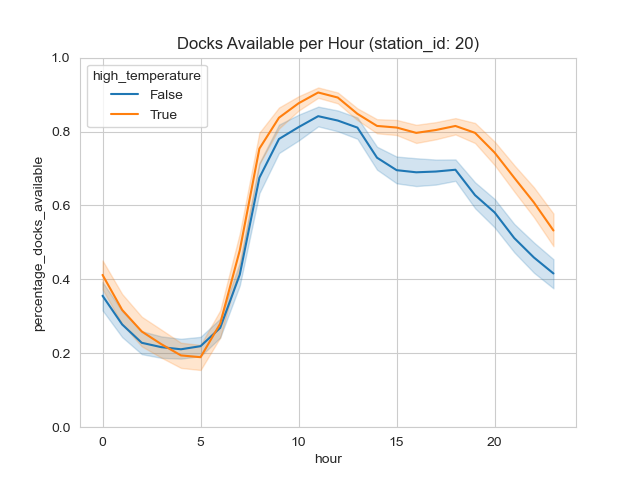
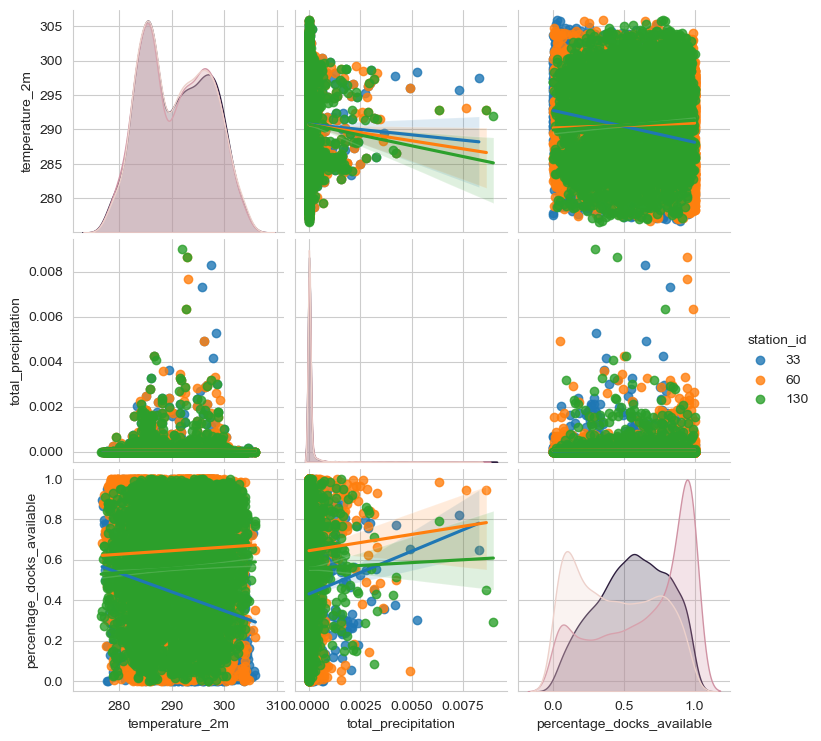

# Capstone project: Bicing
## Preprocessing
### Stations dataset
Después de un análisis de los datos descargados, decidimos **eliminar** aquellos registros que cumpliesen una o más de las siguientes condiciones:
- NaN values
- `df[df['num_bikes_available'] != df['num_bikes_available_types.mechanical'] + df['num_bikes_available_types.ebike']]`
- `df[df['status'] != 'IN_SERVICE']`
- `df[df['is_installed' != 1]]`
- `df[df['is_renting' != 1]]`
- `df[df['is_returning' != 1]]`

`df['last_updated']` y `df['ttl']` -> `YYYY-MM-DD HH:MM:SS` format.

Dado que los datos de validación están en formato **horario**, hemos resampleado los datos a la misma frecuencia temporal, promediando los valores de ocupación durante esa hora.

### Information dataset
Se ha enriquezido el dataset original con las columnas `['lat', 'lon', 'altitude', 'post_code']` que provienen del dataset de información de cada estación.

### Data Analysis
Se puede observar que los promedios de ocupación de las estaciones cambian con variables como `month` y `day_of_week`.

De toods modos, la feature que mejor correlaciona con el porcentaje de ocupación de cada estacion; es el porcentaje de ocupación de la estación en la hora anteior.

### Climate dataset
Hemos añadido datos climáticos (**ERA5 reanalysis**, ECMWF):
- 1h resolución temporal, 0.25º resolución espacial.
- **Temperatura a 2m del suelo**, precipitación, intensidad del viento a 10m del suelo, cloud cover.

## Predictions
Dado que se puede apreciar un comportamiento distinto entre estaciones, se decidió hacer un modelo por estación; para permitir que los coeficientes de regresión cambien por estación.
Además, se utilizó un regresor global para poder predecir las estaciones que no estuvieran en el dataset de training (estaciones nuevas en 2023).

### Transformations
- 'month' (4BinsDIscretizer, encode='onehot')
- 'hour' (12BinsDIscretizer, encode='ordinal')

Además de las disponibles, añadimos las siguientes features:
- 'percentage_docks_available'
- 'percentage_docks_available' shifted 1, 2, 3 and 4 hours (StandardScaler)
- 'is_summer' (OneHotEncoder)
- 'is_weekend' (OneHotEncoder)
- 'is_night' (OneHotEncoder)
- 'day_of_week'
- 'is_work_morning'

### Cross Validation
- scoring: 'neg_root_mean_squared_error'
- split: TimeSeriesSplit(n_split=5) para no entrenar con datos del futuro
- regressor: hemos probado KNN, random forest, pero obtuvimos mejores resultados con una **Linear Regression**

Viendo los coeficientes asociados a cada feature, descartamos aquellos con un coeficiente cercano a 0, quedándonos con las siguientes features:
- sdf
- sdf
- asdf
- asdf
- asdf

Resultados validación: [-0.125, -0.116, -0.098, -0.119, -0.099]

